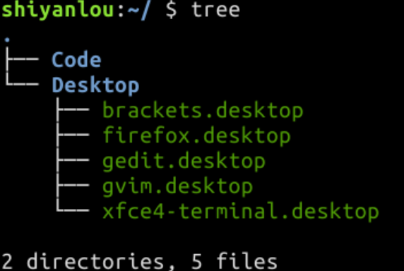
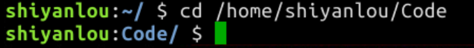
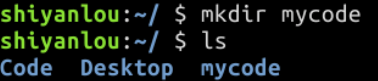
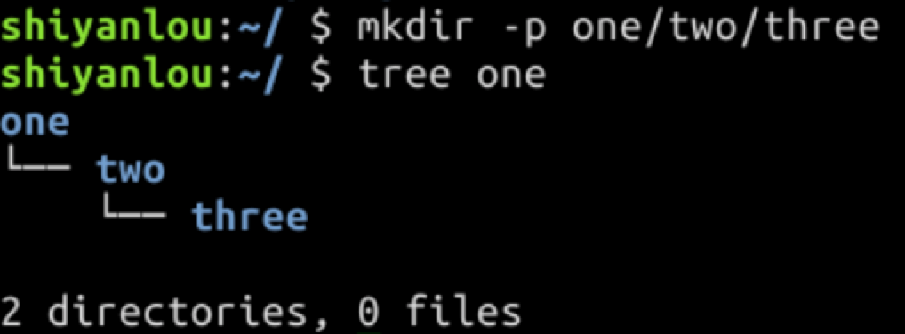
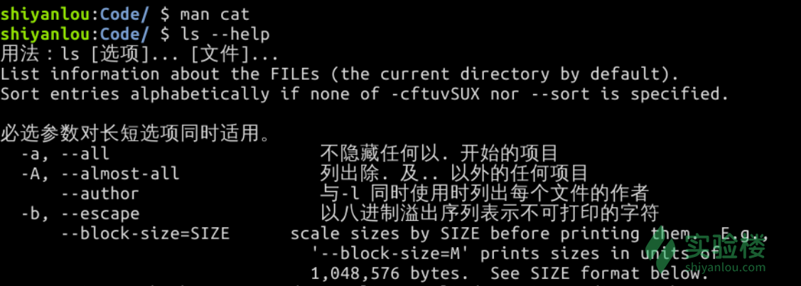
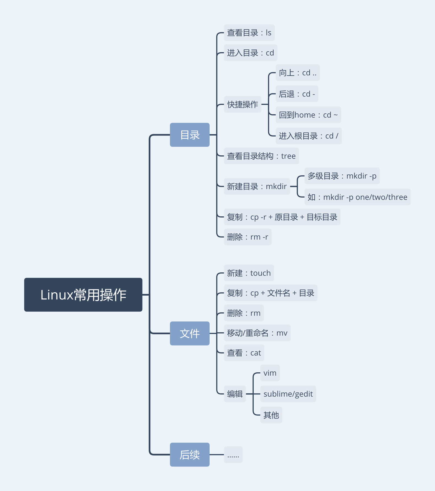

# Linux 简介

- Xfce 终端[^l]：Linux 中控制电脑的窗口
(击菜单上的 编辑 - 首选项， 可以修改终端的背景、字体、字号、光标样式等属性，右下角的输入法图标可以切换输入法)
[^l]:输入命令的入口

- 代码编辑器
gedit、Sublime、GVim

## Linux 操作
 
```bash

shiyanlou:~/ $

```

这就代表着你当前所处的目录位置
hiyanlou 代表你当前的用户名

- 在 $ 后输入 ls ，可查看当前目录下的文件目录.

```bash

shiyanlou:~/ $ ls
anaconda3 Code Desktop
shiyanlou:~/ $ 

```

蓝色代表是目录，白色字代表是文件

- 使用 cd 命令可进入其他目录，如果想进入 Code 目录，请输入：

```bash

cd Code

```

即可进入 Code 目录。

- 上下键可快速选择前面输过的命令。

*****

```bash

cd ..

```

可以回到上一级目录，类似 Windows 的「向上」。

*****

```bash

cd - 

```

表示回到上一次所在的目录，类似 Windows 的「后退」。

******

```bash

cd ~

```

表示回到当前用户的主目录，类似 Windows 的「回到桌面」。

*******

```bash

cd /

```

表示进入根目录，它是一切目录的父目录

*****

# Linux 目录结构

## tree

使用 tree 命令，可以列出一个文件夹下的所有子文件夹和文件（以树形结构来进行列出）。

还记得怎么进入根目录吗？我们来点刺激的，输入：

```bash


cd /

```

再输入：

```bash

tree

```

执行指令后，终端会像走马灯一样，遍历出系统里的所有目录和文件，这时按下 ctrl + c 键即可停止。
这时按下 ctrl + c 键即可停止。

# Linux 文件的基本操作

- Linux 进入目录的方式有绝对路径是(一个以根目录 / 为起点的完整路径)和相对路径(这相当于你在 Windows 系统下，在当前文件夹中点击下一个文件夹进入)两种。

- 有了绝对路径后，不管你当前在哪个目录下，都可以通过指令进入指定目录：

```bash

cd /home/shiyanlou/Code

```


?? 提示：如果忘记了目录名、文件名或命令，可使用 Tab 键自动补全，还可避免输入错误；连续按两次 Tab 可以显示全部候选结果。

## 新建目录

- 使用 **mkdir** 命令可创建目录，**mkdir mycode** 的意思就是新建一个名为 **mycode** 的目录。

- 先输入**cd ~** 返回用户主目录，然后练习一下：



*********

还可以在 **mkdir** 后加入 **-p** 参数，一次性创建多级目录，如：



## 文件操作

- 下面是 Linux 中对文件的常用操作，包含新建、复制、删除等。

### 新建空白文件

- 使用 **touch** 命令可以新建文件

```bash

touch hello

```

（该命令不会覆盖已有同名文件）

***(蓝色为文件夹白色为文件)***

### 复制

- 使用 **cp** 命令（Copy）复制文件到指定目录下

```bash

cp hello one/two/

```

(把 hello 文件复制到 one/two 这个目录下)

   - 如果要复制目录，需要在 cp 后加上 -r ，然后接上 **目录名** ***目标目录名***：

```bash

mkdir test
cp -r test one/two
tree one

```

(通过tree one 直接查看 one 的目录结构)

### 删除

- 使用 **rm** 命令删除文件：

```bash

rm hello

```

- 删除目录要加上 -r 选项，类似 cp -r 拷贝目录，会删除目录和目录下的所有内容

```bash

mkdir test
ls
rm -r test
ls

```

### 移动文件 / 目录与重命名

- 使用 **mv** 命令可以移动文件或目录

```bash

cd ~
touch test1
mkdir dir1
ls
mv test1 dir1
cd dir1
ls

```

- 使用 **touch** 创建空文件 **test1**<br>然后，我们创建一个新目录 **dir1**<br>**ls** 查看一下<br>使用 **mv** 命令 将 **test1** 移动到 **dir1** 目录<br>然后进入 **dir1** 目录查看一下

- **mv** 命令还可以用来重命名，如 **mv** **test1** ***test2***， 会把 **test1** 重命名为 **test2**：

```bash 

ls
mv test1 test2
ls

```

### 查看文件内容

- 使用 **cat** 命令，可以将文件中的内容打印到屏幕上，使用方法是 **cat 文件路径**。

**把 passwd 文件从 /etc 目录拷贝到了当前目录中**

```bash

cp /etc/passwd passwd
ls

```

**用 cat passwd 显示文件中的内容**

```bash

cat passwd

```

` **cat -n** 可以带行号地打印文件内容

### 编辑文件 

- gedit 和 Sublime[^0]

[^0]:编辑工具文本编辑器

###### SublimeText

###### gedit

- 新建文件

点击菜单栏的 **File - New File** 或 **按下ctrl + n**

- 保存文件到桌面

**ctrl + s**

### 帮助命令 

- 遇到困难，可以使用 man 命令，它是 Manual pages 的缩写。

- 有些命令可以使用 --help 选项查看帮助文档。



# 总结


