### 代码部分

- [识别方框的运行代码](src/识别方框.py)

- [识别红绿点的代码](src/识别红绿色点.py)

- [运行总代码](src/总代码.py)

### 数据处理部分

- test one
  - origin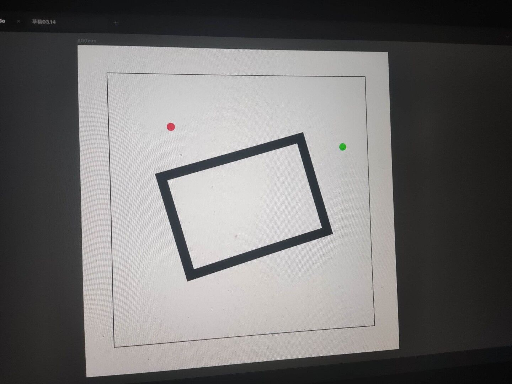 
  - after
     - red-green
      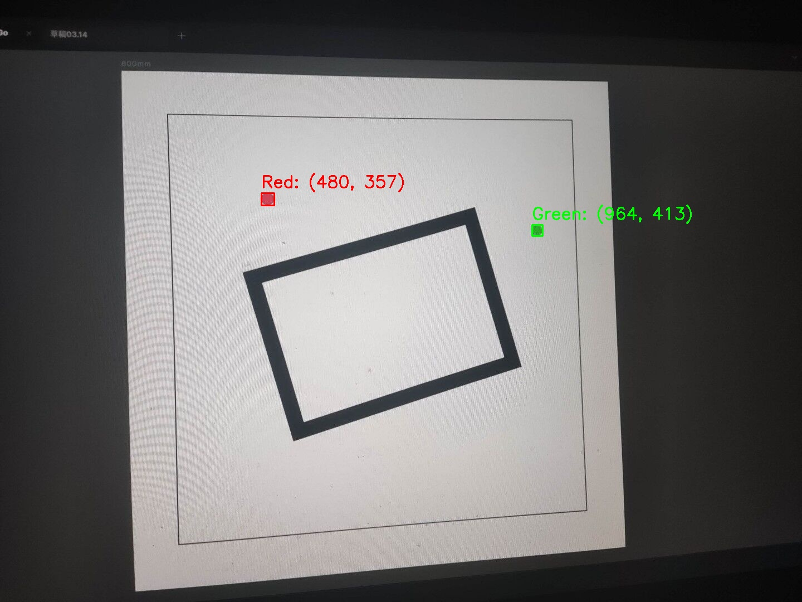
     - square
     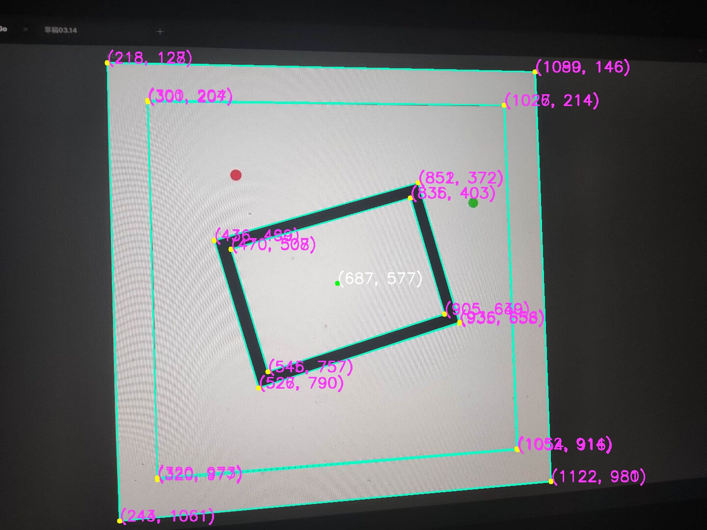

- test two
  - origin
  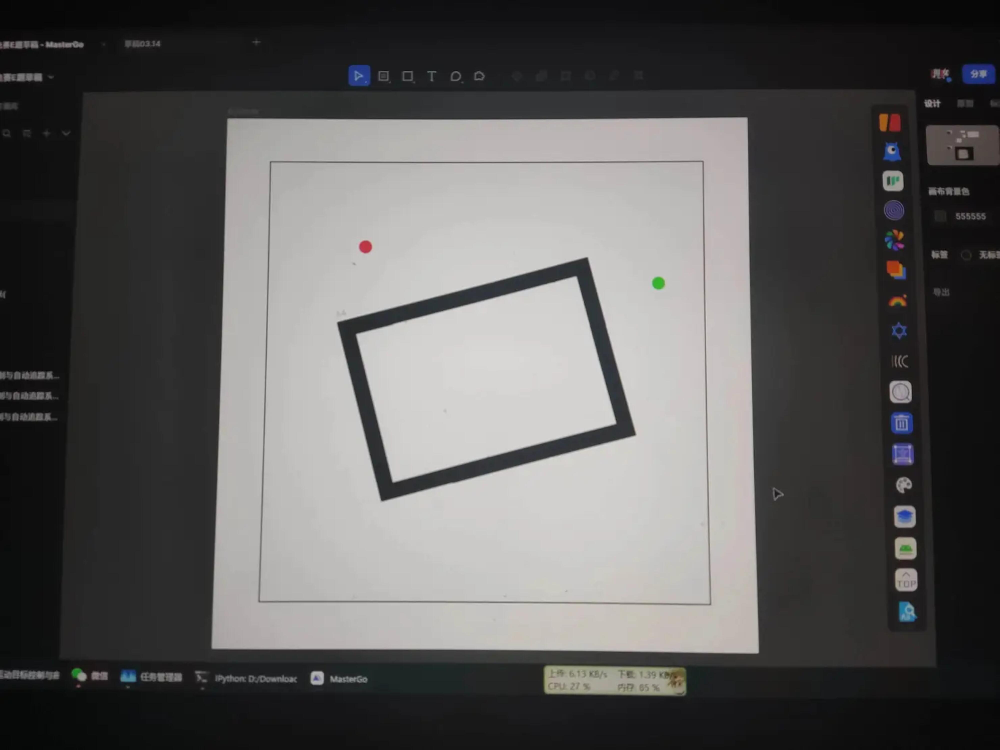 
  - after
     - red-green
    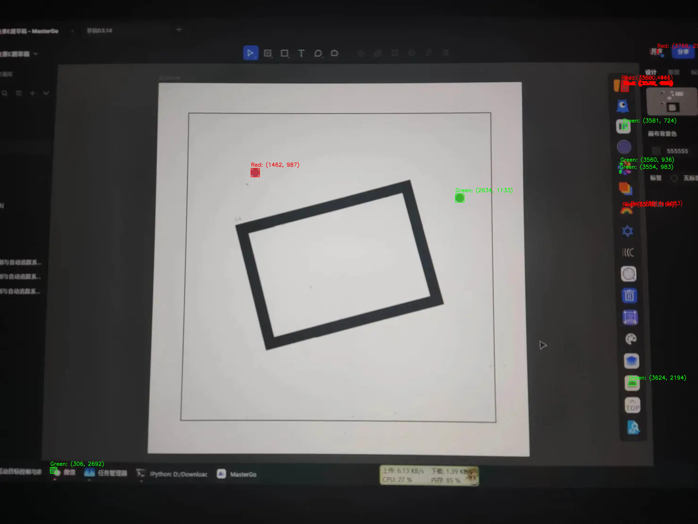
     - square
    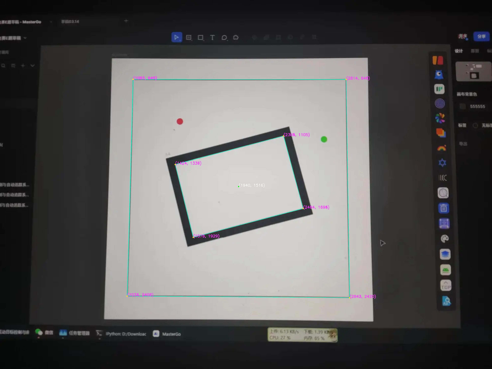

- test three
  - origin
  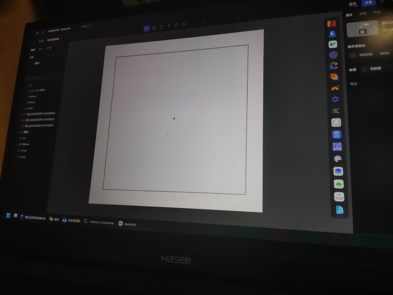 
  - after
     - red-green
     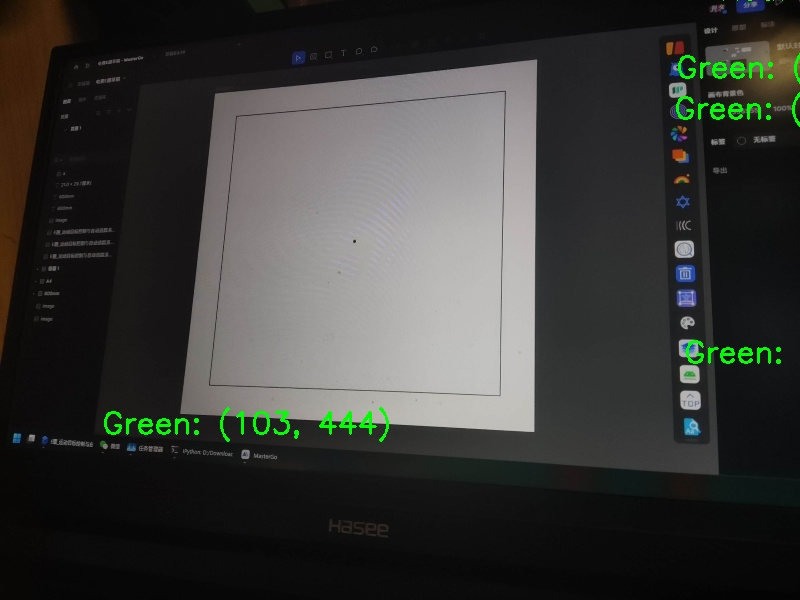
     - square
     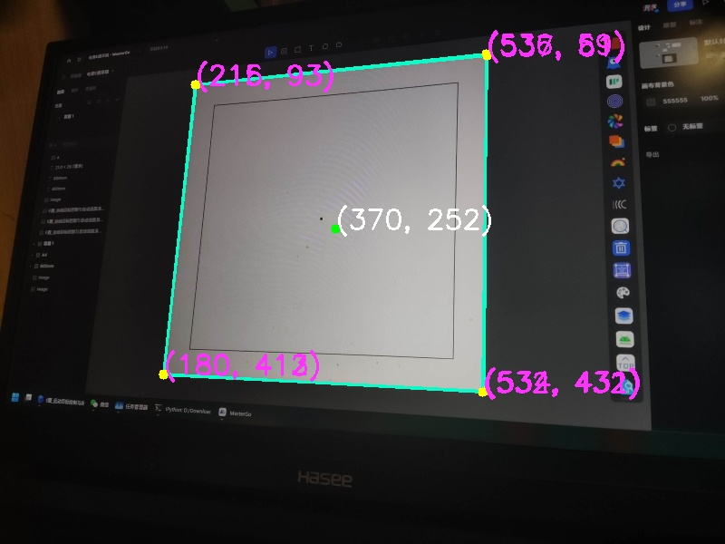

- test four
  - origin
   
  - after
     - red-green
     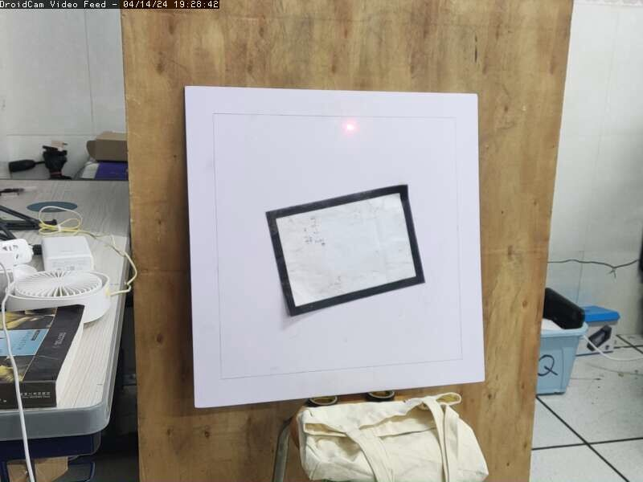
     - square
     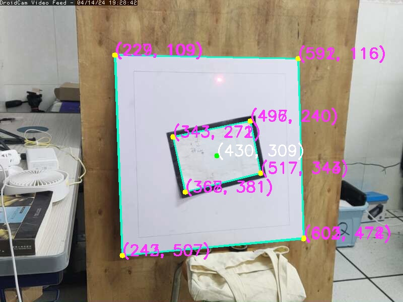

- test five
  - origin
  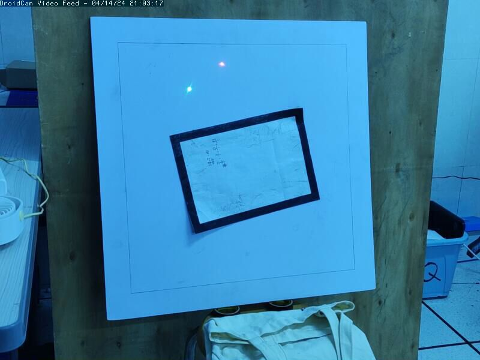 
  - after
     - red-green
     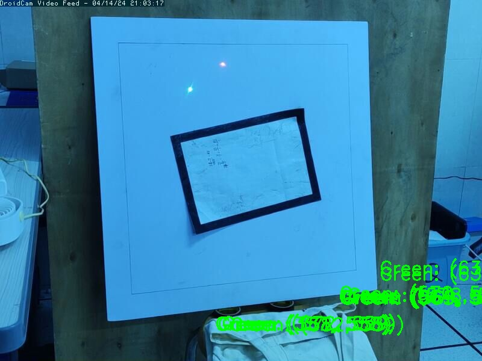
     - square
     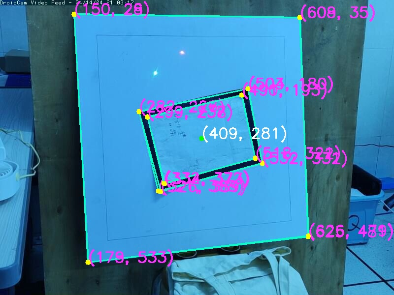

### note
- [用python代码移动文件](note.py)

### 大更新
- 现在代码更加清晰
- 可以直接输入图片名字进行整套的识别处理流程