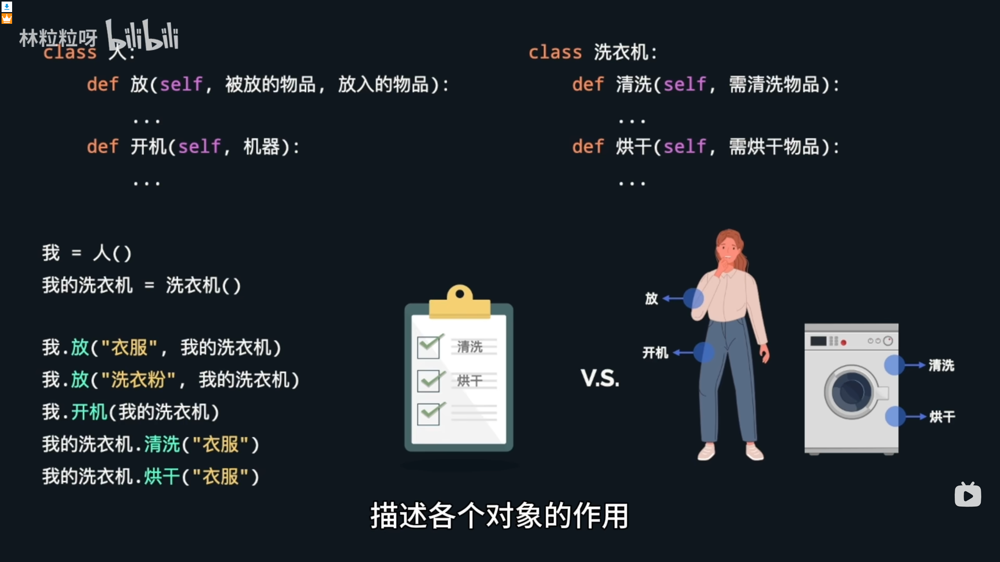
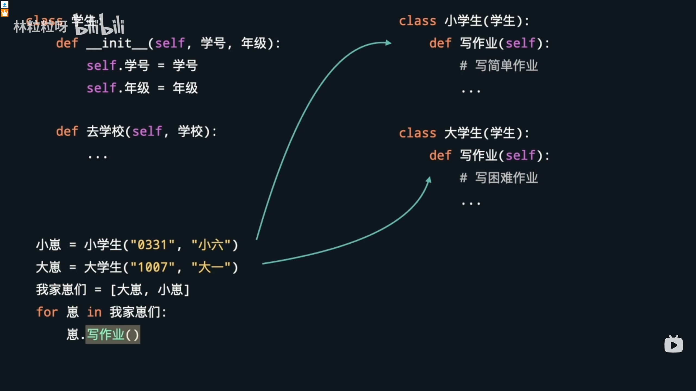

### 面向对象
#### 定义（ATM）类，通过类来创建对象（实例）
- **类**是创建**对象**的*模板*（图纸），**对象**是**类**的*实例*
```python

class ATM:
    def __init__(self, 编号，银行，支行)
    # def __init__(self, 编号，银行，支行)
    #init这一行代码是初始化类的函数，self后面传入的参数是给下面定义的三个属性的值
    self.编号 = 编号
    self.银行 = 银行
    self.支行 = 支行

```
#### 创建ATM对象

```python
# 用对象把相关属性绑定在一起
# 这一步就是创建人物类似于，叫做创建实例
atm1 = ATM("001","招商银行","南园支行")
atm2 = ATM("002","中国银行","北园支行")

```
#### 使用方法

```python
#获取属于atm1的编号
print(atm1.编号)

```

```python
#直接通过对象获取与其绑定的数据
def 存钱(ATM对象,纸币对象):
    打印记录("存钱",ATM对象,纸币对象)

```

[面向对象](week-11\OPP\OPP1.py)

#### 可以创建父类来让子类继承父类的属性

[子类继承父类](week-11\OPP\OPP2.py)
