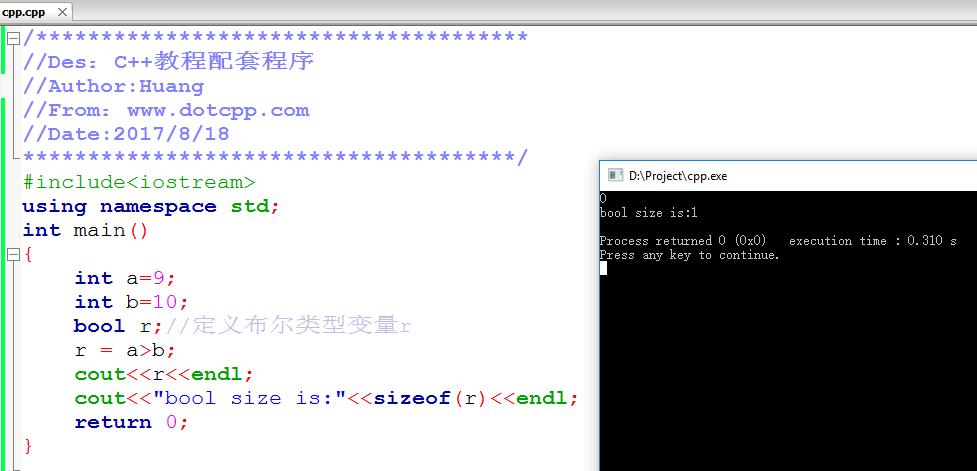
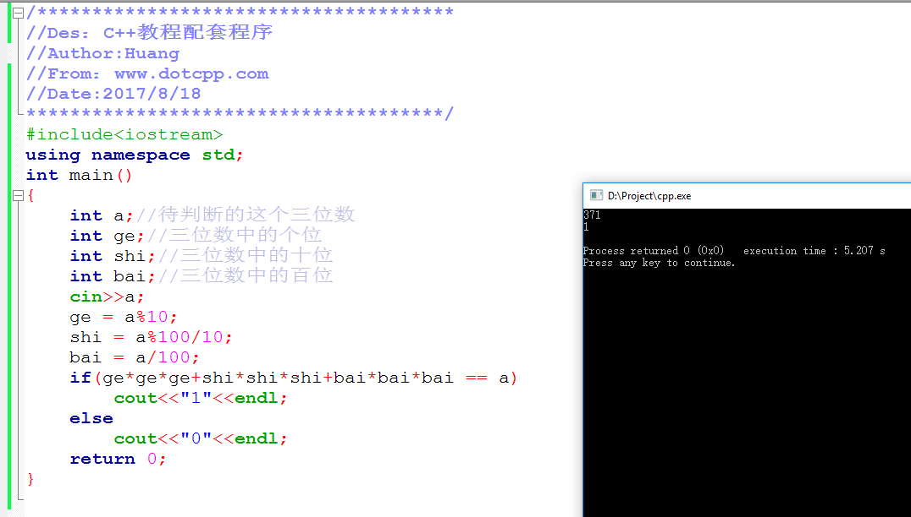
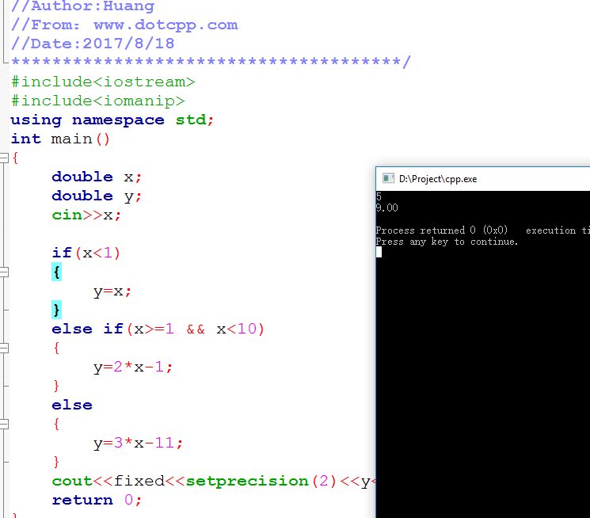

### C++

-----------------------

- 头

```c++

#include<iostream>
using namespace std;
// using namespace std 为了解决多个模块间命名冲突的问题
```
- C++库提供的对象都存放在std这个标准名字空中，比如cin、cout、endl

```c++

#include<iostream>
using namespace std;
//这里直接制定了下面的语法
int main()
{
    cout<<"Nice to meet you!"<<endl;
    return 0;
}

```

- 也可以用域限定符::来逐个制定

```c++
#include<iostream>
int main()
{
    std::cout<<"Nice to meet you!"<<std::endl;
    return 0;
}
//这样写很麻烦，但是就不用开头写using namespace std了。
```
- 用using和域限定符一起制定用哪些名字
```c++
#include<iostream>
using std::cout;
using std::endl;
int main()
{
    cout<<"Nice to meet you!"<<endl;
    return 0;
}
```
-----------------------

#### C++中的输入输出

-  cout输出流的使用
本质上，是将字符串"Hello"插入到cout对象里，并以cout对象作为返回值返回，因此你还可以用<<在后面连续输出多个内容,最常用到的还有endl操纵符，可以直接将它插入到cout里，起输出换行(类似于c的/n)的效果，

```c++
cout<<"Hello"<<endl<<"www.dotcpp.com"<<endl;

```

- cin输入流的使用：
     - cin也可以连续接收多个变量
    
    ```c++
    int a,b;
    cin>>a>>b;
    ```
-------------------

### C++表达式和控制语句

#### C++中的数据类型

- int、char、float、double分别表示整形、字符型、单精度和双精度类型

```c++
#include<iostream>
using namespace std;
int main()
{
    int num;//学生学号
    char sex;//性别
    double score1;//科目一成绩
    double score2;//科目二成绩
    double score3;//科目三成绩
    cout<<"Please input student's ID、‘M’ or ‘W’、score1、score2 and score3"<<endl;
    cin>>num>>sex>>score1>>score2>>score3;
    cout<<"ID:"<<num<<" "<<sex<<" Total score is:"<<score1+score2+score3<<endl;//输出该学生信息及总成绩
    return 0;
}
```

- 布尔类型是一种逻辑值，关键字类型为bool，定义出来的变量只有true和false两个，分别表示真和假两个值，在内存上一般只占一个字节。
```c++
#include<iostream>
using namespace std;
int main()
{
    int a=9;
    int b=10;
    bool r;//定义布尔类型变量r,true 的话 r 为 1 ，false 就为 0
    r = a>b;
    cout<<r<<endl;
    cout<<"bool size is:"<<sizeof(r)<<endl;
    return 0;
}

```
正常会得到如下结果：



```c++
#include<iostream>
using namespace std;
int main()
{
    bool a=true;
    bool b=false;
    cout<<a<<endl<<b<<endl;
    return 0;
}
```
输出结果依然是**1**和**0**并非true和false


---

#### C++算数运算符实例讲解

- 算数运算符（+、-、*、/、%）

```c++
#include<iostream>
using namespace std;
int main()
{
    int a;//待判断的这个三位数
    int ge;//三位数中的个位
    int shi;//三位数中的十位
    int bai;//三位数中的百位
    cin>>a;
    ge = a%10;//取余
    shi = a%100/10;//取余之后取整
    bai = a/100;//取整
    cout<<ge<<" "<<shi<<" "<<bai<<endl;
    return 0;
}
```
运行：
input:485
output:5 8 9

-----
```c++
#include<iostream>
using namespace std;
int main()
{
   int x,y;
   cin>>x;
   if(x<1)
   {
      y=x;
   }
   else if(1<=x && x<10)
   {
      y=2*x-1;
   }
   else
   {
      y=3*x-11;
   }
   cout<<y<<endl;
   return 0;
}
```
运行：
input:14
output:31

-----------

#### C++自增++和自减--运算符实例讲解

- 自增运算符（++）和自减运算符（--）都是单目运算符，即一个变量的使用

```c++

#include<iostream>
using namespace std;
int main()
{
    int a=10;
    cout<<a++<<endl;//++在后，就是先用再加，即先输出在自加1
    cout<<a++<<endl;  
    cout<<a<<endl;
    return 0;
}

```
output:
```
10
11
12
```

#### C++赋值运算符=实例讲解

```c++
#include<iostream>
using namespace std;
int main()
{
    int a=10;//定义变量a，并且将10作为初始化值赋给a
    int b;
    b=a;//将a的值赋值给b
    return 0;
}
```

#### C++关系运算符实例讲解

- *>、< 、>=、<=、!=、==六种*
```c++
 10>5;    // 10大于5，很明显成立，是真
 2>=2;    // 2大于或者等于2，也成立，是真
 3!=1;    // 3不等于1，的确成立，是真
 5==5;    // 5确实等于5，成立，为真
```

- 关系运算符表达式的结果就是非0即1的结果(true or false)

```c++
#include<iostream>
using namespace std;
int main()
{
    cout<<(10>5)<<endl;
    cout<<(2>=2)<<endl;
    cout<<(3!=1)<<endl;
    cout<<(5==5)<<endl;
    return 0;
}
```
output:
```
1
1
1
1
```

#### C++逻辑运算符实例讲解

- &&、||、!
分别表示逻辑与、逻辑或、逻辑非

- &&的两边各一个表达式，如果运算符的左右两边的表达式都为真，表达式整体才为真，否则即为假

- 要求两边各一个表达式，如果运算符左右两边的表达式只要有一个为真，那么逻辑或表达式的整体就为真，否则都为假

- 逻辑非是一个单目运算符，它表示取反的意思，放在表达式的左边，如!a ，即原先为真的表达式取反之后变为假，原先为假的表达式取反之后变为真

```c++

#include<iostream>
using namespace std;
int main()
{
    int a=10;
    int b=20;
    int c=30;
    int d,e;
    d=!c>(b-a)&&(c-b)>(b-a);//如果c不是大于(b-a)而且(c-b)大于(b-a)的话整体为真，d=1；反之为假，d=0
    e=(b-a)||(c-b)&&!(c-b-a);//(b-a)或者(c-b)不等于(c-b-a)的话整体为真，e=1；反之为假，e=0
    cout<<d<<endl;
    cout<<e<<endl;
    return 0;
}
```
output:
```
0
1

```

#### C++if选择结构实例讲解

- 用if选择结构、if-else选择结构、else-if多选择结构以及switch多选择结构
```c++
#include<iostream>
using namespace std;
int main()
{
    int a;//待判断的这个三位数
    int ge;//三位数中的个位
    int shi;//三位数中的十位
    int bai;//三位数中的百位
    cin>>a;
    ge = a%10;
    shi = a%100/10;
    bai = a/100;
    if(ge*ge*ge+shi*shi*shi+bai*bai*bai == a)
        cout<<"1"<<endl;
    else
        cout<<"0"<<endl;
    return 0;
}
```


- 分段函数

```c++

#include<iostream>
#include<iomanip>
using namespace std;
int main()
{
   double x;
   double y;
   cin>>x;
  
   if(x<1)
    {
      y=x;
   }
   else if(x>=1 && x<10)
    {
      y=2*x-1;
   }
   else
    {
      y=3*x-11;
   }
   cout<<fixed<<setprecision(2)<<y<<endl;
   return 0;
}
```


#### C++中switch选择结构实例讲解
- switch结构同样也可以实现多种分支结构，类似else if结构，即对于多种情况时候可以根据条件让程序判断选择走哪个分支，丰富了程序的可能性
```c++
#include<iostream>
using namespace std;
int main()
{
    int n;
    cin>>n;
    switch( n )
    {
        case 0: cout<<"Sunday"; break;
        case 1: cout<<"Monday"; break;
        case 2: cout<<"Tuesday"; break;
        case 3: cout<<"Wednesday"; break;
        case 4: cout<<"Thursday"; break;
        case 5: cout<<"Friday"; break;
        case 6: cout<<"Saturday"; break;
        default :cout<<"input error!";
    }
    return 0;
}
```

#### C++中while循环结构实例讲解
- while循环、do-while循环以及for循环三种，包括配合使用很多的break和continue
##### while循环
- C++中循环相关的题，求A+B的和的简单问题，但为多组测试数据，循环不停的接受，C++的写法如下：
```c++
#include<iostream>
using namespace std;
int main()
{
    int a,b;
    while(cin>>a>>b)
    {
        cout<<a+b<<endl;
    }
    return 0;
}//cin返回的是一个istream的流对象，如果遇到问题接收失败，则返回false，进而结束循环。
```
- 判断素数的题
```c++
#include<iostream>
using namespace std;
int main()
{
    int n,i;
    cin>>n;
    for(i=2;i<n;i++)
    {
        if(n%i==0)
            break;
    }
    if(i>=n)
        cout<<1<<endl;
    else
        cout<<0<<endl;
  
    return 0;
}

```
##### do while循环
- 遇到do先进入循环执行一次循环体里的语句，然后再判断while里的表达式是否成立，
来决定是否进入循环执行第二次
- N以内累加求和
```c++

#include <iostream>
using namespace std;
int main() {
    int N,sum = 0,i;
    cin >> N;
    do
    {
        sum += i;
        i++;
    }while(i<=N);//**
    cout << sum << endl;
    return 0;
}

```

##### for循环
- 求N以内的奇数和
```c++

#include<iostream>
using namespace std;
int main()
{
    int n,i;
    int sum = 0;
    cin >> n;
    for(i = 1; i <= n; i ++)
    {
        if(i % 2 != 0)   //替换为if(i % 2)的效果是一样的
            sum += i;
    }
    cout << sum;
    return 0;
}
```

### C++函数调用与重载、内联
#### C++中函数调用的用法
- 函数调用及传参
```c++
#include<iostream>
#include<cstring>
using namespace std;
int Reverse(char a[],char b[])//字符串逆序
{
    int i=0,n;
    n=strlen(a);
    while(a[i]!='\0')
    {
        b[n-i-1]=a[i];
        i++;
    }
    b[n]='\0';
    return 0;
}
int main()
{
    char str1[100];
    char str2[100];
    cin>>str1;
    Reverse(str1,str2);
    cout<<str2<<endl;
    return 0;
}
```
in
```
44fgh
```
out
```
hgf44
```

#### 带默认形参值的函数
- 允许在自定义函数的形参列表中，给形参一个默认的值，这样在调用的时候如果有实参，那么按照实参传递给形参的方法使用；若调用的时候没有指定对应的实参，则形参将使用默认值。
```c++
#include<iostream>
using namespace std;
int add(int a=3,int b=5)//初始化了参量值
{
    return a+b;
}
int main()
{
    cout<<add(10,20)<<endl;//将10和20分别给a和b
    cout<<add(30)<<endl;//将30给a，b为默认的5
    cout<<add()<<endl;//使用a、b的默认值3和5
    return 0;
}

```
out
```
30
35
8
```

#### C++中的函数重载
- 对于同一个功能函数，可能处理的对象类型不同，则需要重新实现一遍这个函数，这样下去就显得代码更加繁多，C++为了解决这一问题，而支持函数重载来解决这个问题。
```c++
#include<iostream>
using namespace std;
int add(int a,int b)
{
    cout<<"(int ,int)\t";
    return a+b;
}
double add(double a,double b)
{
    cout<<"(doble ,double)\t";
    return a+b;
}
double add(double a,int b)
{
    cout<<"(double ,int)\t";
    return a+b;
}
double add(int a,double b)
{
    cout<<"(int ,double)\t";
    return a+b;
}
int main()
{
    cout<<add(2,3)<<endl;
    cout<<add(2.9,15.3)<<endl;
    cout<<add(10,9.9)<<endl;
    cout<<add(11.5,5)<<endl;
    return 0;
}
//函数重载即两个或以上的函数，函数名相同，但形参类型或个数不同，编译器根据调用方传入的参数的类型和个数，自动选择最适合的一个函数来进行绑定调用，自动实现选择。
```

#### C++函数模板


